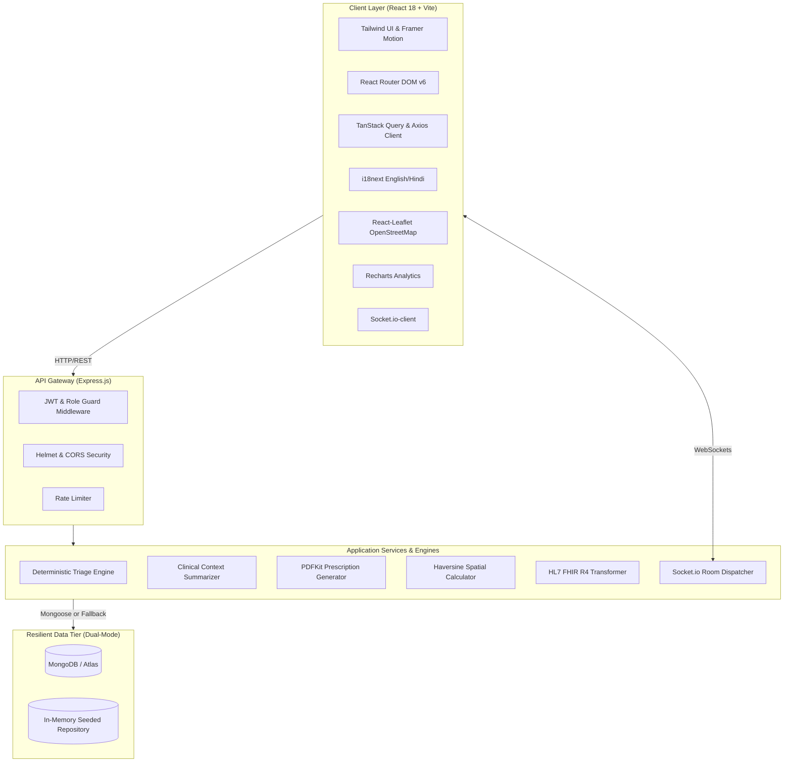

# 🏛️ SwasthSetu: Technical Architecture

## 1. System Overview
SwasthSetu is engineered as a robust, resilient full-stack MERN application with modular decoupled layers tailored for high availability and rural edge resilience.



---

## 2. Dual-Mode Resilient Database Pattern
Rural setups and developer hackathon machines often operate in environments without pre-configured local MongoDB daemons or internet access. SwasthSetu implements a **Zero-Crash Dual-Mode Database Architecture**:

```javascript
// Dual-Mode Pattern implemented in controllers
if (mongoose.connection.readyState === 1) {
  // Primary: Production Mongoose query execution
  data = await Model.find(filter);
} else {
  // Secondary: Instant in-memory demonstration store fallback
  data = memoryStore.collection.filter(predicate);
}
```

The in-memory demonstration store is pre-populated with:
- 5 Role User Accounts with pre-hashed credentials and OTP bypass.
- 11 Public Healthcare Facilities (Sub-Centres, PHCs, CHCs, District Hospitals).
- 45 Patients with realistic longitudinal clinical records and demographic data.
- Live OPD Appointment Queues, Referrals, Medicine Stock, and Emergency logs.

---

## 3. Deterministic Safety-First Triage Engine
In public health systems, patient safety is paramount. SwasthSetu enforces a strict architectural boundary: **AI is advisory; clinical thresholds are absolute.**

- **Input**: Vital signs (Blood Pressure, Heart Rate, Respiratory Rate, Oxygen Saturation, Blood Sugar, Temperature) and reported symptoms.
- **Rules Engine** (`triage.engine.js`):
  - `RED (Critical)`: SpO2 < 90%, HR > 130 or < 40 bpm, SBP > 180 or < 85, Chest Pain, Acute respiratory failure.
  - `YELLOW (Urgent)`: SpO2 90-94%, HR 101-130, SBP 140-179, High fever > 101°F, Altered consciousness.
  - `GREEN (Routine)`: Stable vitals, mild cold, routine checkups.
- **LLM/Heuristic Explanation Engine** (`triage.ai.js`): Generates patient-comprehensible explanations in Hindi and English. The AI is strictly prohibited from altering or downgrading the computed urgency level.

---

## 4. WebRTC Teleconsultation Architecture
- Integrated Jitsi Meet client suite for zero-friction audio/video streaming.
- Secure, room-isolated tokenized video channels per appointment.
- Embedded doctor interface with side-by-side medical history, symptom notes, and live Rx composer.

---

## 5. HL7 FHIR R4 & ABDM Interoperability
SwasthSetu maps internal patient and encounter records to the international HL7 FHIR R4 standard (`/fhir/Patient/:id`):
- `identifier`: Includes National ABHA identifier and internal Medical Record Number (MRN).
- `name`, `telecom`, `gender`, `birthDate`, and `address` standard fields.
- `extension`: Custom extension capturing rural community triage urgency levels.

